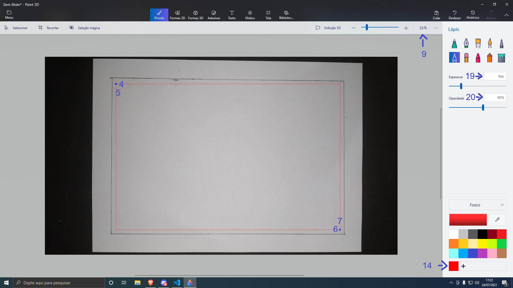
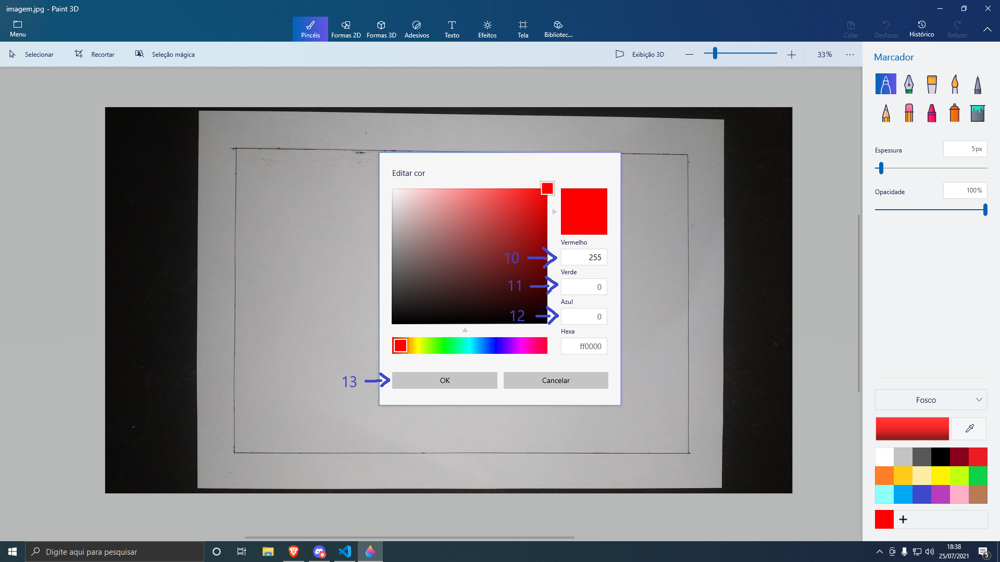
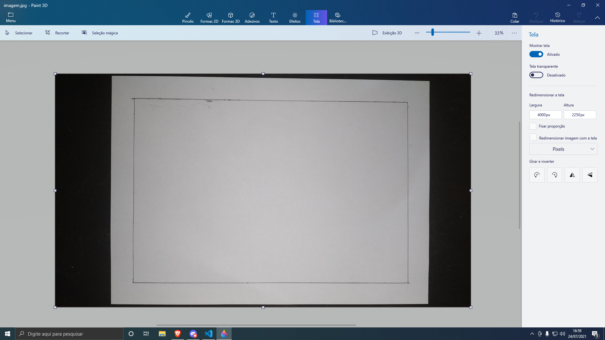
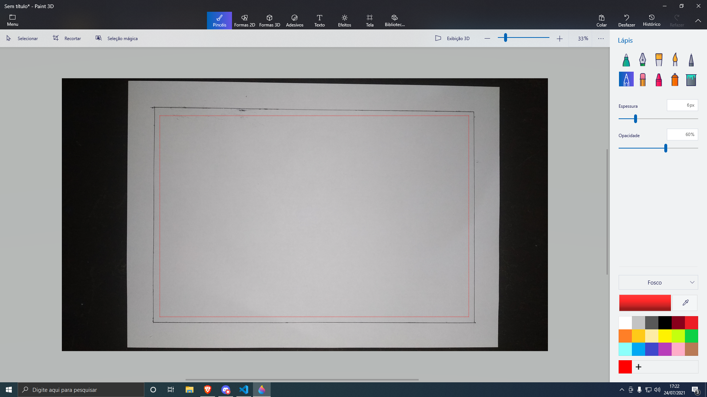

# Python Autodrawer for Paint 3D

EN: A script designed for autodrawing pictures in Paint 3D. Right now the program is entirely written in Brazilian Portuguese, although you can easily use it without any knowledge about Portuguese. Check out the introduction for the script.

PT-BR: Um script feito para desenhar imagens automaticamente no Paint 3D. Veja a seguir as noções básicas de como utilizar o script.

## 1. EN: Requirements | PT-BR: Requisitos

- [Windows 10+](https://www.microsoft.com/software-download/windows10)
- [Paint 3D](https://www.microsoft.com/en-us/p/paint-3d/9nblggh5fv99?source=lp&activetab=pivot:overviewtab)
- [Python 3.8+](https://www.python.org/)
- [PyAutoGUI](https://pypi.org/project/PyAutoGUI/)
- [Keyboard](https://pypi.org/project/keyboard/)
- [Pillow](https://pypi.org/project/Pillow/)

## 2. EN: How to use it | PT-BR: How to use it

:warning: EN: **IT IS VERY IMPORTANT FOR YOU TO READ THIS PART** :warning:

:warning: PT-BR: **É DE SUMA IMPORTÂNCIA QUE VOCÊ LEIA ESTA PARTE** :warning:

### 2.1 EN: The first step | PT-BR: O primeiro passo

EN: The first step is to run the script and then close. Once you did it, a file called **config.ini** will be on the root folder of the script, open it. Now we are going to see the parameters to change inside the file.

PT-BR: O primeiro passo é executar o script e fechar logo em seguida. Uma vez feito, um arquivo chamado **config.ini** irá aparecer na pasta raiz do script, abra-o. Agora veremos os parâmetros dentro do arquivo.

### 2.2 EN: The "config.ini" file | PT-BR: O arquivo "config.ini"

EN: The **config.ini** is the file for changing the parameters. Let's take a look on what we can change here :arrow_heading_down:

PT-BR: O arquivo **config.ini** serve para mudar os parâmetros. Vamos dar uma olhada no que nós conseguimos mexer aqui :arrow_heading_down:

1.  `photo` **EN**: The file you want to draw on Paint 3D. images/photo.png by default. Must be inside the _images_ folder by default | **PT-BR**: O arquivo que você deseja desenhar no Paint 3D. images/photo.png por padrão. Deve estar dentro da pasta *images* por padrão.

2. `monitor_x` **EN**: The X size of your resolution. If you don't know the X size of your resolution, you can run the get_resolution.py inside the _tools_ folder to get it. 1920 by default. Must be an integer | **PT-BR**: O tamanho X da sua resolução. Se você não sabe o tamanho X da sua resolução, você pode abrir o arquivo get_resolution.py dentro da pasta _tools_ para obte-lá. 1920 por padrão. O valor deve ser do tipo integer por padrão.

3. `monitor_y` **EN**: The Y size of your resolution. If you don't know the Y size of your resolution, you can run the get_resolution.py inside the _tools_ folder to get it. 1080 by default. Must be an integer | **PT-BR**: O tamanho X da sua resolução. Se você não sabe o tamanho Y da sua resolução, você pode abrir o arquivo get_resolution.py dentro da pasta _tools_ para obte-lá. 1080 por padrão. O valor deve ser do tipo integer por padrão.

4.  `canvas_topleftx` **EN**: The X position of the top left corner of your canvas. 434 by default. Must be an integer. We will cover about "canvas" later | **PT-BR**: A posição X do canto superior esquerdo do seu canvas. 434 por padrão. O valor deve ser do tipo integer. Você verá mais sobre "canvas" a seguir.

5.  `canvas_toplefty` **EN**: The Y position of the top left corner of your canvas. 315 by default. Must be an integer. We will cover about "canvas" later | **PT-BR**: A posição Y do canto superior esquerdo do seu canvas. 315 por padrão. O valor deve ser do tipo integer. Você verá mais sobre "canvas" a seguir.

6.  `canvas_bottomrightx` **EN**: The X position of the Bottom Right Corner of your canvas. 1273 by default. Must be an integer. We will cover about "canvas" later | **PT-BR**: A posição X do canto inferior direito do seu canvas. 1273 por padrão. O valor deve ser do tipo integer. Você verá mais sobre "canvas" a seguir.

7.  `canvas_bottomrighty` **EN**: The Y position of the Bottom Right Corner of your canvas. 862 by default. Must be an integer. We will cover about "canvas" later | **PT-BR**: A posição Y do canto inferior direito do seu canvas. 862 por padrão. O valor deve ser do tipo integer. Você verá mais sobre "canvas" a seguir.

8.  `canvas_zoom` **EN**: Paint 3D's zoom value. 33 by default. Must be an integer. We will cover about "canvas" later | **PT-BR**: Valor do zoom no Paint 3D. 33 por padrão. O valor deve ser do tipo integer. Você verá mais sobre "canvas" a seguir.

9. `canvas_zoompos` **EN**: A tuple with two values. The first one is the X position of the zoom selector on the screen. The second one is the Y value of the zoom selector on the screen. (1576, 102) by default. Must be a tuple | **PT-BR**: Uma tupla com dois valores. O primeiro valor é a posição X do selecionador de zoom na tela. O segundo valor é a posição Y do selecionador de zoom na tela. (1576, 102) by default. O valor deve ser uma tupla.

9.  `keyboard_interruptionKey` **EN**: The keyboard key to interrupt the program. 'space' by default. Must be a key compatible with [PyAutoGUI's keys](https://pyautogui.readthedocs.io/en/latest/keyboard.html#keyboard-keys) | **PT-BR**: A tecla usada para interromper o programa. 'space' por padrão. O valor deve ser uma tecla compatível com a [lista de teclas do PyAutoGUI](https://pyautogui.readthedocs.io/en/latest/keyboard.html#keyboard-keys).
 
10.  `colorSelector_rpos` **EN**: A tuple with two values. The first one is the X position of the R value in the color picker. The second one is the Y position of the R value in the color selector. (1145, 493) by default. Must be a tuple | **PT-BR**: Uma tupla com dois valores. O primeiro valor é a posição X da cor R no selecionador de cores. O segundo valor é a posição Y da cor R no selecionador de cores. (1145, 493) por padrão. O valor deve ser uma tupla.

11.  `colorSelector_gpos` **EN**: A tuple with two values. The first one is the X position of the G value in the color picker. The second one is the Y position of the G value in the color selector. (1145, 550) by default. Must be a tuple | **PT-BR**: Uma tupla com dois valores. O primeiro valor é a posição X da cor G no selecionador de cores. O segundo valor é a posição Y da cor G no selecionador de cores. (1145, 550) por padrão. O valor deve ser uma tupla.

12.  `colorSelector_bpos` **EN**: A tuple with two values. The first one is the X position of the B value in the color picker. The second one is the Y position of the B value in the color selector. (1145, 606) by default. Must be a tuple | **PT-BR**: Uma tupla com dois valores. O primeiro valor é a posição X da cor B no selecionador de cores. O segundo valor é a posição Y da cor B no selecionador de cores. (1145, 606) por padrão. O valor deve ser uma tupla.

13.  `colorSelector_okbutton` **EN**: A tuple with two values. The first one is the X position of the OK button in the color picker. The second one is the Y position of the OK button in the color selector. (851, 728) by default. Must be a tuple | **PT-BR**: Uma tupla com dois valores. O primeiro valor é a posição X do botão de OK no selecionador de cores. O segundo valor é a posição Y do botão de OK no selecionador de cores. (851, 728) por padrão. O valor deve ser uma tupla.

14.  `colorPalette_colorpos` **EN**: A tuple with two values. The first one is the X position of the color to be changed in the color palette. The second one is the Y position of the color to be changed in the color palette. (1695, 997) by default. Must be a tuple | **PT-BR**: Uma tupla com dois valores. O primeiro valor é a posição X da cor para ser trocada na palheta de cores. O segundo valor é a posição Y do cor para ser trocada na palheta de cores. (1695, 997) por padrão. O valor deve ser uma tupla.

15.  `draw_tool` **EN**: The tool you want to use. The available tools are: "pencil, crayon, pixelpen". 'pencil' by default | **PT-BR**: A ferramenta que você deseja usar. As ferramentas disponíveis são: "pencil, crayon, pixelpen". 'pencil' por padrão.

16.  `draw_thickness` **EN**: The thickness of the tool. 6 by default. Must be an integer > 0 | **PT-BR**: A espessura da ferramenta. 6 por padrão. O valor deve ser do tipo integer e maior que 0.

17. `draw_opacity` **EN**: The opacity of the tool. 60 by default. Must be an integer > 0 and < 101 | **PT-BR**: A opacidade da ferramenta. 60 por padrão. O valor deve ser do tipo integer maior que 0 e menor que 101.

19.  `draw_thicknesspos` **EN**: A tuple with two values. The first one is the X position of the thickness selector on the screen. The second one is the Y position of the thickness selector on the screen. (1866, 285) by default. Must be a tuple | **PT-BR**: Uma tupla com dois valores. O primeiro é a posição X do selecionador de espessura na tela. O segundo valor é a posição Y no selecionador de espessura na tela. (1866, 285) por padrão. O valor deve ser uma tupla.

20.  `draw_opacitypos` **EN**: A tuple with two values. The first one is the X position of the opacity selector on the screen. The second one is the Y position of the opacity selector on the screen. (1863, 365) by default. Must be a tuple | **PT-BR**: Uma tupla com dois valores. O primeiro é a posição X do selecionador de opacidade na tela. O segundo valor é a posição Y do selecionador de opacidade na tela. (1863, 365) por padrão. O valor deve ser uma tupla.

21.  `delay` **EN**: The delay value of drawing pixels on the canvas. :warning: **WARNING** :warning:: Lower values might crash/glitch Paint 3D. If you are experiencing glitches even with the default value, please INCREASE the value. 0.01 by default. Must be a float | **PT-BR**: O valor do delay de desenhar pixels no canvas. :warning: **ATENÇÃO** :warning:: Valores mais baixos podem causar travamentos ou bugs no Paint 3D. Se você estiver presenciando bugs/glitches/erros com o valor padrão, por favor AUMENTE-O. 0.01 por padrão. O valor deve ser do tipo float.

### 2.2.1 EN: Understanding the parameters with Paint 3D | Entendendo os parâmetros com o Paint 3D

EN: Take a look on the screenshot below.

PT-BR: Repare na captura de tela abaixo.

EN: Notice that each number represents a topic above with the respective positions. Also, take a look on the 14th topic (the `colorPalette_colorpos` parameter): if it is your first time using Paint 3D and/or you haven't created a custom color yet, just press the add button and create a custom color (it can be any color, just create). Now, take a look on the screenshot below.

PT-BR: Repare que cada número representa um tópico acima com as respectivas posições. Agora, repare o tópico 14 (o parâmetro `colorPalette_colorpos`): se é a sua primeira vez usando Paint 3D e/ou você nunca criou uma cor personalizada, aperte o botão com o símbolo "+" e crie uma cor personalizada (pode ser qualquer cor, apenas crie). Agora repare na captura de tela abaixo.

EN: If you right click on your custom color and click on _edit_, this color editor will open. And again: each number is related to a topic above. To get the screen positions, the next topic will cover this.

PT-BR: Se você clicar com o botão direito do mouse na cor personalizada e clicar em _editar_, este editor de cores irá abrir. E novamente: cada número está relacionado com um tópico acima. Para pegar as posições da tela, o próximo tópico irá abordar isto.

### 2.2.2 EN: Getting the screen positions | PT-BR: Pegando as posições na tela

EN: As you may see, the X and Y position of the values inside the _config.ini_ file are designed specifically for my resolution (1920x1080, Full HD), so if you have a different resolution, you'll need to change some values. To get the screen coordinates, there's a script inside the _tools_ folder called *get_x_y.py* that will help you. So, run it (I would recommend open it with Command Prompt) and press Control (can be both left or right) to get the current XY cursor position. Check out the screenshot below.

PT-BR: Como você pode ver, as posições X e Y dos valores dentro do arquivo _config.ini_ são específicamente feitos para a minha resolução (1920x1080, Full HD), então, se você têm uma resolução diferente, muito provavelmente você irá precisar mudar alguns valores. Para pegar as coordenadas da tela, há o script *get_x_y.py* que irá te ajudar no mesmo. Então, abra-o (eu recomendo abrir o script com o Prompt de Comando) e aperte Control (pode ser tanto o esquerdo como o direito) para pegar a posição atual do cursor. Veja a captura de tela abaixo.

EN: Notice that the X and Y position in the prompt are both 0, that's because my cursor was at the top left edge (anyways, the cursor wasn't captured in the screenshot). Obviously, if you change the cursor's position, the coordinates will change too.

PT-BR: Repare que as posições X e Y no prompt são 0, isso é porque meu cursor estava no canto superior esquerdo (todavia, o cursor não foi capturado na captura de tela). Obviamente, se você mudar a posição do cursor, as coordenadas irão mudar também.

### 2.3 EN: Understanding "canvas" | PT-BR: Entendendo o "canvas"

EN: Canvas is the drawable area that the script will be using for the drawing. Take a look at the screenshot below.

PT-BR: O canvas é a área na qual o programa irá usar para desenhar. Repare na captura de tela abaixo.

EN: I loaded up a simple image: an A4 paper flipped horizontally with a black border in a black background. The point is: I just want the script to draw within the borders, so, how do I do this? It's easy: just take the top left corner and bottom right corner XY position and set it up on the `canvas_topleftx`, `canvas_toplefty`, `canvas_bottomrightx`, `canvas_bottomrighty` parameters inside the _config.ini_ file. If you want to check the drawable area you have, just run the *draw_drawingarea.py* script that it will automatically draw the borders for you. Check the example below.

PT-BR: Eu abri uma imagem simples: uma folha A4 virada na horizontal com uma margem preta num fundo preto. O ponto é: eu somente quero que o script desenhe dentro da margem, então, como é que eu faço isso? É fácil: é só pegar as posições XY do canto superior esquerdo e do canto inferior direito e colocá-las nos parâmetros `canvas_topleftx`, `canvas_toplefty`, `canvas_bottomrightx`, `canvas_bottomrighty` dentro do arquivo _config.ini_. Se você deseja conferior a área desenhável que você possui, basta rodar o script *draw_drawingarea.py* que irá desenhar automáticamente as margens para você. Olhe o exemplo abaixo.

EN: Once I runned the *draw_drawingarea.py* script, a red border was drawn representing the drawable area I have. The program will only be able to draw within this area. Also, the drawing will be in the center of the canvas. Also, notice that the image is 4000x2250px and my zoom is set to 33% because it is the better choice for me. Obviously, if you have a different image and/or a different resolution, you'll need to change the parameters inside _config.ini_.

PT-BR: Uma vez que eu rodei o script *draw_drawingarea.py*, uma margem vermelha foi desenhada representando o espaço desenhável que eu tenho. O programa apenas irá desenhar dentro dessa área. Além disso, o desenho será no centro do "canvas". Também repare que a imagem é 4000x2250px e o meu zoom está em 33%, pois é a melhor escolha para mim. Obviamente, se você tiver uma imagem diferente e/ou um monitor diferente, você terá que mudar os parâmetros dentro de _config.ini_.

## 3. EN: Running the script | PT-BR: Rodando o script

 EN: Once you set every parameter and coordinate on _config.ini_ and the main file (if your resolution is not 1920x1080), just run the script and change to the Paint 3D as your active window. The script will run without any problems if you followed every step above. You can see the script running on the video below.

PT-BR: Uma vez que você configurou cada parâmetro e coordenada no arquivo _config.ini_ e no _main_ (se sua resolução não for 1920x1080), apenas rode o script e deixe o Paint 3D como sua janela ativa. O script irá rodar sem nenhum problema se você seguiu todos os passos acima. Você pode ver o script rodando no vídeo abaixo.

EN: If you followed the steps above, probably you'll not find any problems, but, if you find, it is probably related to the screen coordinates, so be aware that you may need to change it inside *config.ini* and the main file.

PT-BR: Se você seguiu todos os passos acima, provavelmente você não irá encontrar nenhum problema, mas caso encontre, provavelmente estará relacionado ás suas coordenadas de tela, então fique atento pois você talvez tenha que mudar as configurações dentro do *config.ini* e do arquivo _main_

## 4. FAQ

Q: **EN**: Paint 3D is crashing/slowing down/glitching, how do I solve? | **PT-BR**: Paint 3D está crashando/travando/bugando, como eu resolvo isso?

- A/R: **EN**: As written in the _config.ini_, this is probably related to the `delay` parameter. You may need to increase the value to stop slowing down Paint 3D | **PT-BR**: Como está escrito no _config.ini_, isso provavelmente está relacionado ao parâmetro `delay`. Você provavelmente irá precisar aumentar o valor para parar os travamentos no Paint 3D.

Q: **EN**: Can you briefly explain how this script works? | **PT-BR**: Teria como você explicar brevemente como este script funciona?

- A/R: **EN**: This script works by iterating with each pixel on your desirable picture, then, putting the R/G/B/A values inside a list. With this list, the script will automatically use the keyboard and cursor (like a Macro) to work with Paint 3D and automatically draw on the canvas | **PT-BR**: Este script funciona iterando com cada pixel na foto desejável, e então, colocando os valores R/G/B/A dentro de uma lista. Com esta lista, o script irá automaticamente usar o teclado e o mouse (como um Macro) para trabalhar no Paint 3D e automaticamente desenhar dentro do canvas.

Q: **EN**: What are the default values designed for? | **PT-BR**: Para que sistema foi projetado os valores padrões?

- A/R: **EN**: The default values are designed for a 1920x1080 monitor, running on a 4000x2250px canvas. So, if you want to quickly use the script, just change the `photo` parameter inside *config.ini* and set the canvas to 4000x2250px on Paint 3D | **PT-BR**: Os valores padrões foram projetados para um monitor 1920x1080, rodando-os num canvas 4000x2250px. Então se você deseja rapidamente usar o script, apenas mudar o parâmetro `photo` dentro do arquivo *config.ini* e ajuste o canvas para 4000x2250px no Paint 3D.

Q: **EN**: There's a bug I want to report, how can I reach you? | **PT-BR**: Há um bug na qual eu desejo reportar, como posso contactá-lo?

- A/R: **EN**: You can open a discussion here in this repository or reach me on my email: *felipeflohrlol@gmail.com*. Feel free to call me there | **PT-BR**: Você pode abrir uma discussão aqui neste repositório ou me chamar no meu email: *felipeflohrlol@gmail.com*. Sinta-se a vontade para me chamar lá.

Q: **EN**: Why did you made this? This is useless. | **PT-BR**: Por que você fez isso? Isso é inútil.

- A/R: **EN**: The reason I made this script was because my art teacher was sending a lot of homework to do (seriously, a lot), and since I'm having online classes I thought of doing this script as a way to help me doing the homework | **PT-BR**: O motivo de eu ter feito este script é porque a minha professora de artes estava mandando muita tarefa para eu fazer (sério, muita tarefa mesmo), e já que eu estou fazendo EAD, eu pensei em fazer este script como uma maneira de me ajudar a fazer as tarefas.
